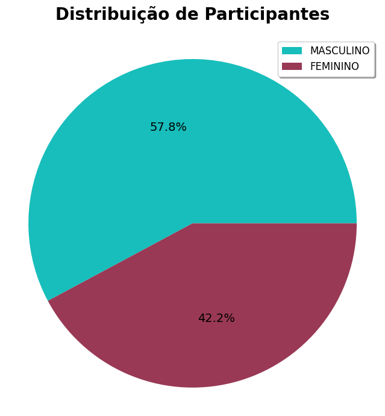
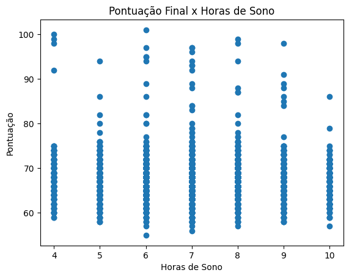
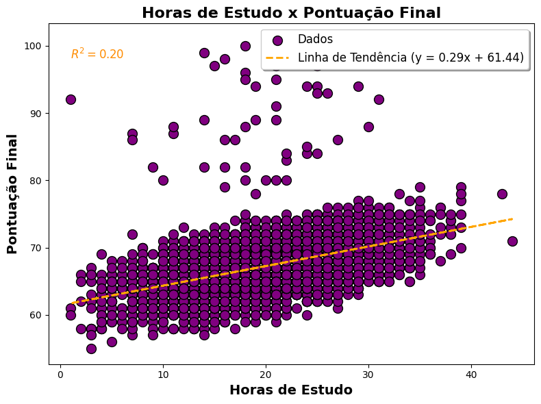
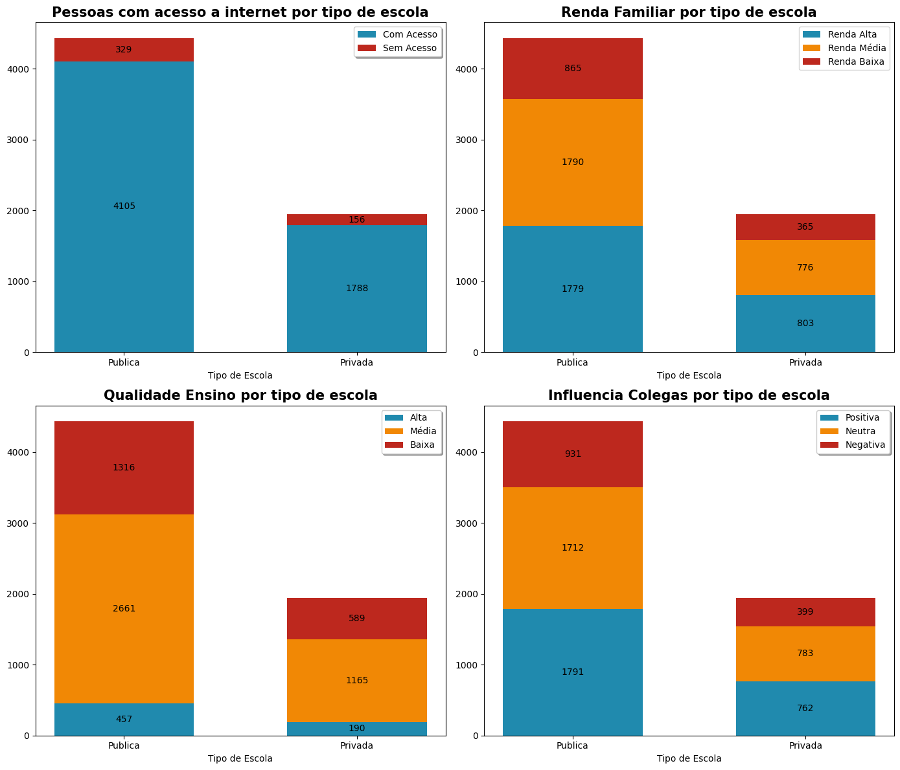
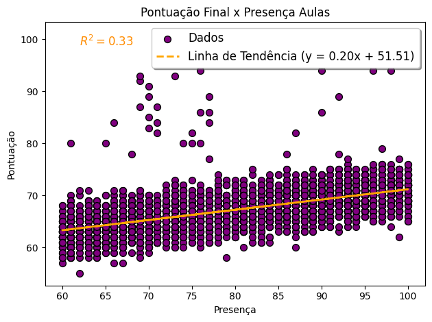
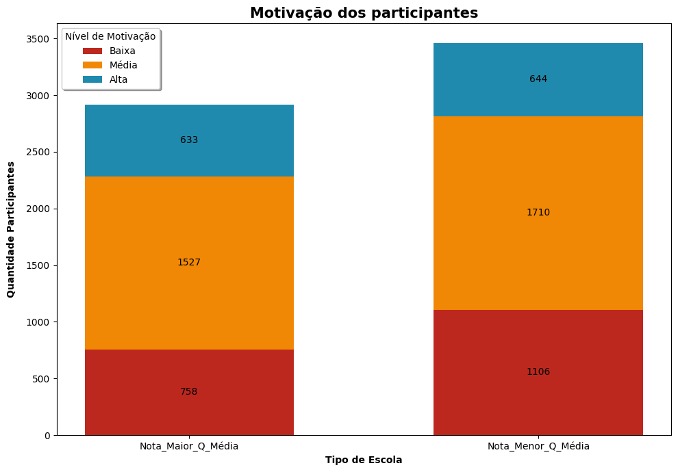
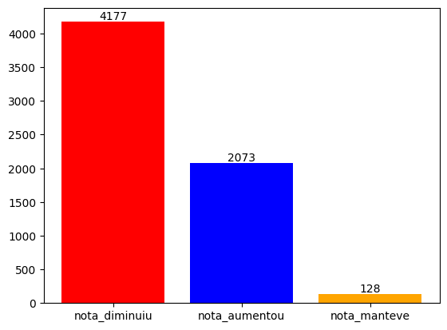

# RELATÓRIO FINAL (ANÁLISE DE DADOS)

Diante das dificuldades observadas no desempenho dos alunos em provas, foi disponibilizada uma base de dados contendo informações sobre estudantes, suas performances e hábitos relacionados ao período que antecede o exame final. Essa base foi obtida no site Kaggle [(Student Performance Factors Dataset)](https://www.kaggle.com/datasets/fatihyavuzz/studentperformancefactors), uma plataforma que não só fornece bases de dados, mas também disponibiliza ferramentas para aprimorar habilidades e aplicar conhecimentos aprendidos. Nos propomos a analisar a base de dados, preparando o ambiente e importando as bibliotecas necessárias para o processo:

- `pip install pandas`
- `pip install numpy`
- `pip install matplotlib`
- `pip install ydata-profiling`
- `pip install scikit-learn`

Em seguida, importamos nossa base de dados utilizando a biblioteca `pandas` e geramos uma pequena visualização.

| Hours_Studied | Attendance | Parental_Involvement | Access_to_Resources | Extracurricular_Activities | Sleep_Hours | Previous_Scores | Motivation_Level | Internet_Access | Tutoring_Sessions | Family_Income | Teacher_Quality | School_Type | Peer_Influence | Physical_Activity | Learning_Disabilities | Parental_Education_Level | Distance_from_Home | Gender | Exam_Score |
|---------------|------------|----------------------|---------------------|----------------------------|-------------|------------------|------------------|-----------------|-------------------|---------------|-----------------|-------------|----------------|-------------------|------------------------|-------------------------|--------------------|--------|------------|
| 23            | 84         | Low                  | High                | No                         | 7           | 73               | Low              | Yes             | 0                 | Low           | Medium          | Public     | Positive      | 3                 | No                     | High School             | Near               | Male   | 67         |
| 19            | 64         | Low                  | Medium              | No                         | 8           | 59               | Low              | Yes             | 2                 | Medium        | Medium          | Public     | Negative      | 4                 | No                     | College                | Moderate           | Female | 61         |
| 24            | 98         | Medium               | Medium              | Yes                        | 7           | 91               | Medium            | Yes             | 2                 | Medium        | Medium          | Public     | Neutral       | 4                 | No                     | Postgraduate           | Near               | Male   | 74         |
| 29            | 89         | Low                  | Medium              | Yes                        | 8           | 98               | Medium            | Yes             | 1                 | Medium        | Medium          | Public     | Negative      | 4                 | No                     | High School            | Moderate           | Male   | 71         |
| 19            | 92         | Medium               | Medium              | Yes                        | 6           | 65               | Medium            | Yes             | 3                 | Medium        | High            | Public     | Neutral       | 4                 | No                     | College                | Near               | Female | 70         |

>A base de dados apresenta 20 colunas, das quais 7 possuem valores numéricos, enquanto as demais contêm dados textuais ou categóricos.

Cada coluna representa um aspecto relevante para análise, conforme descrito a seguir:

- "Hours Studied" – Número de horas que o aluno estudou
- "Attendance" - Taxa de frequência ou porcentagem de aulas frequentadas pelo aluno
- "Parental_Involvement" - Nível de envolvimento dos pais na vida acadêmica do aluno
- "Access_to_Resources" - Disponibilidade de recursos educacionais para o aluno
- "Extracurricular_Activities" - Participação em atividades extracurriculares
- "Sleep_Hours" - Número médio de horas que o aluno dorme por noite
- "Previous_Scores" - Notas ou desempenhos acadêmicos anteriores do aluno
- "Motivation_Level" - Nível de motivação do aluno em relação aos objetivos acadêmicos
- "Internet_Access" - Indica se o aluno tem acesso à internet (Yes/No)
- "Tutoring_Sessions" – Número de sessões de tutoria ou mentoria frequentadas pelo aluno
- "Family_Income" - Nível de renda da família do aluno
- "Teacher_Quality" - Qualidade percebida dos professores (por exemplo, avaliada por experiência ou feedback)
- "School_Type" - Tipo de escola que o aluno frequenta (por exemplo, pública, privada)
- "Peer_Influence" - Nível de influência dos colegas no desempenho acadêmico do aluno
- "Physical_Activity" - Quantidade de atividade física realizada pelo aluno
- "Learning_Disabilities" - Indica se o aluno tem alguma deficiência de aprendizado (Sim/Não)
- "Parental_Education_Level" - Nível de escolaridade dos pais do aluno
- "Distance_from_Home" - Distância entre a casa do aluno e a escola
- "Gender" - Gênero do aluno
- "Exam_Score" - Nota do aluno em um exame recente

---

## PREPARANDO DADOS

Ao analisar mais profundamente nossa base de dados, identificamos a presença de valores vazios em algumas linhas. Para lidar com isso, optamos por eliminar todas as linhas que apresentassem algum campo vazio. Essa operação foi realizada utilizando o seguinte comando da biblioteca Pandas no Python: `dataset.dropna(inplace=True)`. Após executar este comando, houve uma redução no número de linhas na base de dados. Inicialmente, o dataset possuía 6607 linhas, mas, após a remoção, passaram a restar 6378 linhas, garantindo que não houvesse mais campos vazios. Além disso, realizamos uma alteração nos nomes das colunas da tabela, com o objetivo de tornar os dados mais intuitivos e facilitar futuras análises. Além disso, realizamos uma alteração nos nomes das colunas da tabela, com o objetivo de tornar os dados mais intuitivos e facilitar futuras análises. As novas colunas ficaram assim: 

- "Hours Studied" – "Horas_Estudo"
- "Attendance" – "Presenca"
- "Parental_Involvement" – "Envolvimento_Pais"
- "Access_to_Resources" – "Acesso_Recursos"
- "Extracurricular_Activities" – "Atividade_Extracurricular"
- "Sleep_Hours" – "Horas_Sono"
- "Previous_Scores" – "Pontuacao_Anterior"
- "Motivation_Level" – "Nivel_Motivacao"
- "Internet_Access" – "Acesso_Internet"
- "Tutoring_Sessions" – "Tutoria"
- "Family_Income" – "Renda_Familiar"
- "Teacher_Quality" – "Qualidade_Ensino"
- "School_Type" – "Tipo_Escola"
- "Peer_Influence" – "Influencia_Colegas"
- "Physical_Activity" – "Atividade_Fisica"
- "Learning_Disabilities" – "Deficiencia_Aprendizagem"
- "Parental_Education_Level" – "Educacao_Pais"
- "Distance_from_Home" – "Distancia_EscolaCasa"
- "Gender" – "Genero"
- "Exam_Score" – "Pontuacao_Final"

Mais tarde, utilizamos a biblioteca `ydata-profiling` para gerar um relatório visual simples, com o objetivo de obter insights iniciais para orientar nossa análise. O relatório foi salvo em formato HTML com o nome [relatorio_student_performance.html](relatorio_student_performance.html).

A partir da leitura do relatório, identificamos diversas questões relevantes a serem exploradas, como:

1. **Comparação de desempenho por gênero:** Avaliar as diferenças de desempenho entre participantes de diferentes gêneros no exame.
2. **Impacto das horas de sono:** Analisar como a quantidade de horas de sono influencia o desempenho dos participantes.
3. **Influência das horas de estudo:** Investigar a relação entre o tempo dedicado ao estudo e os resultados obtidos no exame.
4. **Comparação entre tipos de ensino:** Entender e comparar o desempenho de participantes provenientes de diferentes sistemas de ensino.
5. **Efeito da presença em aulas:** Verificar se a frequência nas aulas realmente influencia o desempenho dos alunos.
6. **Desempenho e motivação:** Analisar como diferentes níveis de motivação afetam o desempenho dos participantes.
7. **Perfil dos maiores pontuadores:** Desenvolver uma análise sobre os 150 participantes com as maiores pontuações no exame final.
8. **Comparação de desempenho entre exames:** Analisar os fatores que contribuíram para o aumento ou diminuição das notas dos alunos quando comparados com o exame anterior, buscando identificar padrões ou hábitos que influenciam a melhoria ou piora no desempenho.

Essas análises serão fundamentais para entender os principais fatores que impactam o desempenho dos participantes e fornecer insights valiosos para futuras decisões ou intervenções.

---

## ANÁLISES REALIZADAS

### 1º - ANÁLISE (GÊNERO):

O primeiro passo foi comparar algumas medidas de resumo aplicadas sobre a coluna "Pontuacao_Final", separando o nosso dataset por gênero (Masculino / Feminino):

| Medidas   | Masculino | Feminino |
|-----------|-----------|----------|
| count     | 3.688     | 2.690    |
| mean      | 67,23     | 67,27    |
| std       | 3,78      | 4,09     |
| max       | 99,00     | 101,00   |
| min       | 55,00     | 57,00    |

Com base na análise, pudemos concluir alguns pontos importantes. Primeiramente, observamos que a quantidade de participantes do gênero masculino supera a do gênero feminino em 998 indivíduos. Além disso, percebemos que os valores do gênero feminino apresentam maior dispersão, evidenciada por um desvio padrão ligeiramente mais alto em comparação ao grupo masculino. Outro aspecto relevante é que a maior nota obtida no exame final pertence ao grupo feminino, enquanto a menor nota está associada ao grupo masculino. Esses dados indicam diferenças interessantes entre os dois grupos, tanto em termos de distribuição quanto de desempenho.

Para facilitar a visualização diante da diferença entre a quantidade de participantes dos dois diferentes gêneros, foi gerado o seguinte gráfico de setores:

    

Posteriormente, exploramos os hábitos praticados por ambos os grupos de participantes, mas não identificamos diferenças significativas ao considerar o conjunto completo de dados. No entanto, ao analisarmos apenas os 10 maiores pontuadores do exame final, surgiram algumas observações interessantes. Entre os 10 melhores resultados, 6 participantes pertenciam ao gênero feminino e 4 ao masculino. Dentre os 5 primeiros colocados, 4 eram mulheres, evidenciando um desempenho predominante do grupo feminino nessa faixa de destaque. Além disso, foi observado que, nesse grupo seleto, os participantes do gênero masculino apresentaram uma média de horas estudadas maior em comparação ao grupo feminino. Por outro lado, as mulheres tiveram uma média de horas de sono mais alta e registraram uma maior frequência nas aulas, indicando possíveis diferenças nas estratégias de preparação e hábitos relacionados ao desempenho.

---

### 2º - ANÁLISE (HORAS DE SONO):

Observando as horas de sono dos nossos participantes, conseguimos concluir que as maiores notas obtidas no exame final foram obtidas por participantes que, em geral, não ultrapassavam 7 horas de sono por dia. Como mostra o gráfico:

    

---

### 3º - ANÁLISE (HORAS DE ESTUDO):

Observando as horas destinadas ao estudo, conseguimos gerar a seguinte visualização (gráfico de dispersão com linha de tendência):

    

É importante destacar que, embora muitos participantes tenham obtido notas altas no exame final mesmo dedicando poucas horas ao estudo, foi possível identificar uma tendência clara que relaciona a quantidade de horas estudadas à pontuação final. Essa tendência indica que, de maneira geral, quanto maior o número de horas destinadas ao estudo, maior é a probabilidade de alcançar uma pontuação mais elevada.

---

### 4º - ANÁLISE (TIPO ESCOLA):

À primeira vista, observamos que nossa base de dados contém um número significativamente maior de alunos provenientes de escolas públicas em comparação com escolas privadas. A diferença entre os dois grupos ultrapassa 2.000 alunos, destacando um desequilíbrio considerável na representatividade dos tipos de escola. Mais tarde, geramos algumas visualizações buscando entender as diferentes realidades dos participantes de tipos de escola distintos:

    

Analisando os gráficos gerados uma importante que se registre aqui que os dados seguem uma proporção, de forma que a quantidade de participantes de escola publica de uma determinada categoria são próximos do dobro dos participantes das mesmas categorias, mas da escola privada. 

---

### 5º - ANÁLISE (PRESENÇA):

Geramos um gráfico de dispersão com a linha de tendência representando a relação entre a pontuação obtida no exame e o nível de presença nas aulas:

    

Observamos que, embora alguns participantes tenham alcançado pontuações altas mesmo com baixa frequência nas aulas, é evidente uma tendência clara que indica: quanto maior o nível de presença do aluno nas aulas, maior a probabilidade de obter uma pontuação elevada no exame final.

---

### 6º - ANÁLISE (MOTIVAÇÃO):

A fim de entender melhor sobre o perfil dos nossos participantes dividimos nosso dataset em dois grupos de participantes, aqueles que tiraram uma pontuação maior que a média e aqueles que tiraram uma nota abaixo. Em seguida analisamos o nível de motivação em cada um desses grupos:

    

É interessante notar que, embora os grupos apresentem uma diferença significativa no número total de participantes, a quantidade de indivíduos com alta motivação permaneceu praticamente equivalente em ambos os grupos.

---

### 7º - ANÁLISE (150 MAIORES PONTUADORES):

Decidimos estender nossa análise, filtrando os 150 maiores pontuadores da nossa base de dados para observar quais fatores contribuíram para que eles se destacassem no exame. Portanto, geramos as seguintes tabelas:

#### Medidas referente aos 150 maiores pontuadores:

| Medidas     | Horas Estudo | Presença | Horas Sono | Atividade Física |
|-------------|--------------|----------|------------|------------------|
| Mean        | 26,32        | 89,65    | 6,8        | 3,02             |
| Std         | 7,20         | 10,54    | 1,3        | 1,13             |

#### Medidas referente ao dataset total:

| Medidas     | Horas Estudo | Presença | Horas Sono | Atividade Física |
|-------------|--------------|----------|------------|------------------|
| Mean        | 19,00        | 80,02    | 7,03       | 2,97             |

Observamos que, além da presença e das horas dedicadas ao estudo, a prática de atividades físicas também desempenhou um papel significativo para que os participantes alcançassem o status de top 150 no exame final. Posteriormente, passamos a analisar as probabilidades associadas aos participantes desse grupo de destaque, identificando alguns resultados interessantes que merecem destaque:

- Apenas 6% dos 150 maiores pontuadores estavam em um contexto de baixa qualidade de ensino.
- 7,66% dos participantes não tinham acesso à internet.
- Cerca de 30% vieram de escolas particulares.
- Aproximadamente 50% estudavam em ambientes escolares com influência positiva.

Esses dados revelam padrões importantes e reforçam a necessidade de analisar as características comuns entre os maiores pontuadores para compreender os fatores que mais contribuíram para o desempenho excepcional.

---

### 8º - ANÁLISE (DESEMPENHO NOTAS):

Por fim analisamos a evolução das notas, comparando as pontuações antigas com as novas obtidas no exame. Obtendo o seguinte gráfico:

    

Foi possível observar que mais de 4.100 participantes apresentaram uma diminuição em suas notas de um exame para o outro, tendo apenas 2073 alunos aumentando sua pontuação e 128 que se mantiveram. Diante disso, propusemos uma análise comparativa entre os grupos que obtiveram aumento nas notas e aqueles que apresentaram redução, com o objetivo de identificar diferenças em seus hábitos. Ao realizar essa análise, percebemos que os alunos que conseguiram melhorar suas notas dedicaram, em média, mais horas de estudo e tiveram uma frequência ligeiramente maior nas aulas em comparação aos que não alcançaram o mesmo progresso. Esses fatores sugerem uma correlação positiva entre hábitos consistentes e melhoria no desempenho acadêmico.

---

## CONCLUSÃO:
A análise dos dados revelou padrões significativos que ajudam a compreender os fatores que influenciam o desempenho dos alunos no exame final.

- Desempenho por Gênero: Observamos que o número de participantes do gênero masculino era maior do que o feminino, mas o grupo feminino apresentou maior dispersão nas notas. Curiosamente, a maior pontuação foi alcançada por uma participante do gênero feminino, enquanto a menor nota foi do grupo masculino. Esse dado aponta para um desempenho mais consistente entre as mulheres, embora com uma maior variação.

- Hábitos de Estudo e Sono: A relação entre as horas de estudo e a pontuação final mostrou que, em geral, quanto mais horas os alunos dedicavam ao estudo, maior era a chance de obter uma pontuação elevada. No entanto, notou-se que, apesar disso, muitos alunos conseguiram boas notas com menos horas de estudo. Quanto ao sono, as melhores pontuações foram alcançadas por aqueles que não ultrapassaram 7 horas de sono por dia, sugerindo que o equilíbrio entre estudo e descanso pode ser um fator importante para o sucesso.

- Tipo de Escola e Presença nas Aulas: A maioria dos participantes veio de escolas públicas, o que reflete um desequilíbrio na representatividade dos tipos de escola. Analisando a presença nas aulas, foi constatado que alunos com maior frequência tendem a obter notas mais altas, embora alguns participantes com baixa presença também tenham se destacado, indicando que outros fatores, como o foco e o desempenho nas provas, podem também desempenhar um papel importante.

- Análise dos Maiores Pontuadores: Entre os 150 maiores pontuadores, destacaram-se hábitos de estudo consistentes, alta presença nas aulas e a prática de atividades físicas. Além disso, um número considerável de alunos desse grupo não enfrentava problemas como baixa qualidade de ensino ou falta de acesso à internet, sugerindo que fatores como infraestrutura escolar e ambiente de aprendizado também são determinantes para o desempenho.

- Evolução nas Notas: A comparação entre as notas anteriores e atuais mostrou que mais de 4.100 participantes apresentaram uma diminuição nas notas, enquanto 2.073 conseguiram melhorar. Aqueles que aumentaram suas pontuações tinham em média mais horas de estudo e maior frequência nas aulas, o que reforça a importância de hábitos consistentes para a melhoria do desempenho.

Em resumo, a análise sugere que fatores como dedicação ao estudo, presença nas aulas e o equilíbrio entre estudo e descanso são cruciais para o sucesso acadêmico. Além disso, a qualidade do ambiente escolar, o apoio familiar e as condições de infraestrutura desempenham papéis importantes na formação do desempenho dos alunos.

